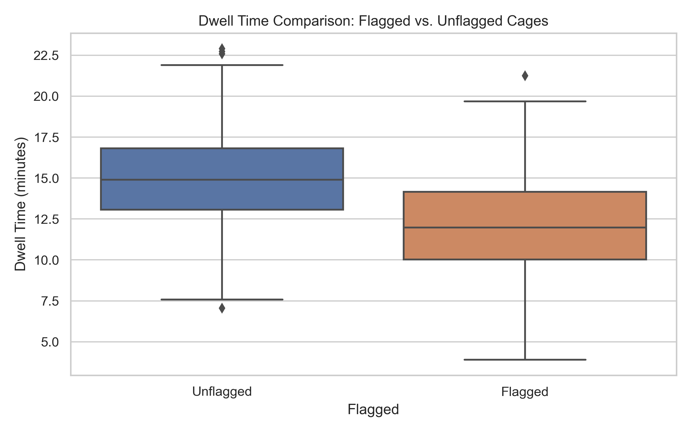

# Cage Flag Optimization Experiment Report

## 1. Objective

The goal of this experiment was to determine whether **flagging cages** in a fulfillment center affects their **dwell time** — the time a cage waits before being stowed.

---

## 2. Methodology

- **Design**: A/B-style comparison between flagged and unflagged cages.
- **Data**: 500 synthetic cage records with randomized flag assignment.
- **Primary Metric**: Dwell time (in minutes).
- **Statistical Method**: Independent two-sample t-test.

---

## 3. Summary Statistics

| Flag Status | Count | Mean Dwell Time (min) | Std Dev |
|-------------|-------|------------------------|---------|
| Flagged     | 259   | 12.17                  | 3.10    |
| Unflagged   | 241   | 14.86                  | 2.92    |

- Flagged cages had a **2.69-minute** shorter average dwell time compared to unflagged cages.
- Sample sizes were approximately balanced.

---

## 4. Visual Analysis

- **Flagged cages** exhibit both a lower median and tighter spread.
- **Unflagged cages** show a longer tail and more variability in dwell time.
- The visual trend supports the hypothesis that flagging improves efficiency.

---

## 5. Statistical Test

- **T-statistic**: -9.98  
- **P-value**: < 0.0001

### Interpretation:

Since p < 0.05, we reject the null hypothesis.  
There is a **statistically significant** difference in dwell times between groups.  
**Flagged cages dwell for significantly less time** on average.

---

## 6. Conclusion

This experiment provides **strong statistical evidence** that flagging cages reduces their dwell time in a fulfillment center environment.

- Average dwell time reduction: **~2.7 minutes**
- Statistically significant at p < 0.0001

**Operational Insight**: Cage flagging may reduce congestion and improve flow-through efficiency in inbound or stow areas.

---

## 7. Recommendations & Next Steps

 **Operational Recommendations**
- Consider expanding cage flagging procedures across all inbound lines.
- Prioritize flagged cages during stow when under peak volume pressure.

 **Future Work**
- Apply same analysis to real production data.
- Measure downstream effects (e.g., stowing time, productivity per associate).
- Incorporate flag logic into warehouse management systems or dashboards.

---

## Appendix

- Code and data generation available in `scripts/generate_fake_data.py`
- Analysis notebooks available in `notebooks/eda_flagged_vs_unflagged.ipynb`
